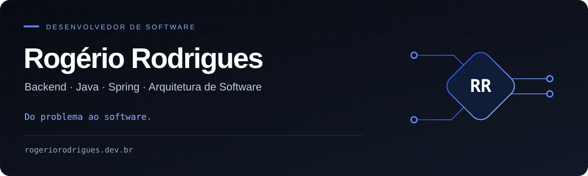

  <a href="https://rogeriorodrigues.dev.br/"><strong>Site pessoal</strong></a>
  &nbsp; · &nbsp;
  <a href="https://www.linkedin.com/in/rogeriorodriguesti/"><strong>LinkedIn</strong></a>
  &nbsp; · &nbsp;
  <a href="https://rogeriorodrigues.dev.br/lab"><strong>Rogério.AI</strong></a>
  &nbsp; · &nbsp;
  <a href="mailto:contato@rogeriorodrigues.dev.br"><strong>Contato</strong></a>

## Sobre mim

Desenvolvedor de software com foco em **backend, APIs e integrações**, especialmente no setor financeiro. Trabalho com Java e Spring na construção de serviços e fluxos transacionais, com atenção à segurança, clareza dos contratos e manutenção do código.

Também construo projetos próprios com **IA e automação**, conectando problemas de negócio a soluções que podem ser usadas na prática.

## Explore meu trabalho

| Site pessoal | Rogério.AI |
| :--- | :--- |
| Minha trajetória, experiência e áreas de atuação em desenvolvimento de software. | Uma experiência de IA para explorar ideias de tecnologia, produto e arquitetura. |
| [**Conhecer minha trajetória ↗**](https://rogeriorodrigues.dev.br/) | [**Experimentar o Rogério.AI ↗**](https://rogeriorodrigues.dev.br/lab) |

## Tecnologias principais

Ver outras tecnologias e ferramentas

| Área | Tecnologias |
| :--- | :--- |
| Linguagens e frameworks | Kotlin, Spring Cloud, Spring Security, Hibernate |
| APIs e integrações | REST, OpenAPI, GraphQL, Apache Camel, IBM MQ, Azure Event Hubs, Azure API Management |
| Dados e cache | Oracle, Azure Cosmos DB, Redis |
| Infraestrutura | Kubernetes, OpenShift |
| Entrega e qualidade | Git, Jenkins, Azure DevOps, Maven, Gradle, JUnit, SonarQube |
| Observabilidade | Grafana, Prometheus, Splunk, Dynatrace |
| Documentação e colaboração | draw.io, Jira, Confluence |

## Experiência aplicada

- **Backend corporativo:** serviços com Java e Spring, contratos de API e integração com sistemas internos.
- **Arquitetura e integrações:** mensageria, serviços distribuídos e fluxos transacionais.
- **Domínio financeiro:** regras de negócio, produtos de investimento e jornadas digitais.
- **Engenharia:** testes, documentação, análise de impacto e revisão técnica.

## Como eu trabalho

Entendo o problema antes de escolher a tecnologia. Busco soluções proporcionais ao contexto, com código legível, testes úteis e contratos claros. Segurança, rastreabilidade, resiliência e observabilidade fazem parte das decisões de engenharia.

Parte da minha atuação envolve sistemas proprietários. Apresento minha experiência sem expor código ou informações confidenciais.

---

**Vamos conversar?** [LinkedIn](https://www.linkedin.com/in/rogeriorodriguesti/) · [E-mail](mailto:contato@rogeriorodrigues.dev.br) · [Instagram](https://www.instagram.com/rogerice/)
